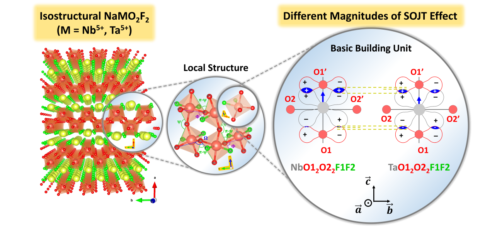

# Supporting Data for “Different Magnitudes of Second-Order Jahn-Teller Effect in Isostructural NaMO2F2 (M = Nb5+, Ta5+) Oxyfluorides”

## Graphical Abstract

**Author:** Ouail Zakary  
**ORCID:** [0000-0002-7793-3306](https://orcid.org/0000-0002-7793-3306)  
**E-mail:** [Ouail.Zakary@oulu.fi](mailto:Ouail.Zakary@oulu.fi)  
**Website:** [Ouail Zakary - webpage](https://cc.oulu.fi/~nmrwww/members/Ouail_Zakary.html)

This is the Supporting Dataset for the manuscript “Different Magnitudes of Second-Order Jahn-Teller Effect in Isostructural NaMO2F2 (M = Nb5+, Ta5+) Oxyfluorides”.

The dataset comprises the following sections:

1. Powder X-ray diffraction data. ([directory](./powder_X-ray_diffraction/))
2. Thermogravimetric and differential thermal analyses data. ([directory](./TGA_DTA/))
3. Solid-state nuclear magnetic resonance spectroscopy data. ([directory](./ssNMR_spectra_exp_&_fit/))
4. First principle calculations data. ([directory](./first_principle_calculations/))
5. Python scripts and raw numerical data for all figures included in the main manuscript and the Supporting Information. ([directory](./figures/))

## Citations

If you use this data, please cite the following: \
\
**Preprint:** Zakary, O.; Body, M.; Sarou-Kanian, V.; Arnaud, B.; Corbel, G.; Legein, C. Different Magnitudes of Second-Order Jahn-Teller Effect in Isostructural NaMO2F2 (M = Nb5+, Ta5+) Oxyfluorides. *Mater. Res. Bull.* **2024**.

\
**Dataset:** Zakary, Ouail; Body, Monique; Sarou-Kanian, Vincent; Arnaud, Brice; Corbel, Gwenaël; Legein, Christophe (**2024**). Supporting Data for “Different Magnitudes of Second-Order Jahn-Teller Effect in Isostructural NaMO2F2 (M = Nb5+, Ta5+) Oxyfluorides”. *figshare. Dataset.*

---

For further details, please refer to the respective folders or contact the author via the provided email.
